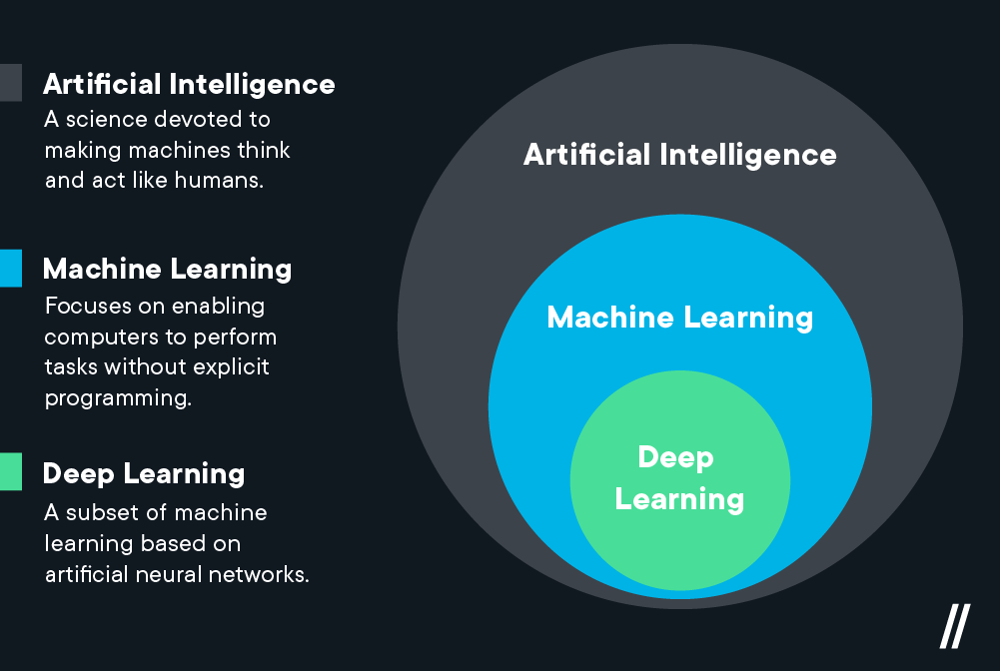
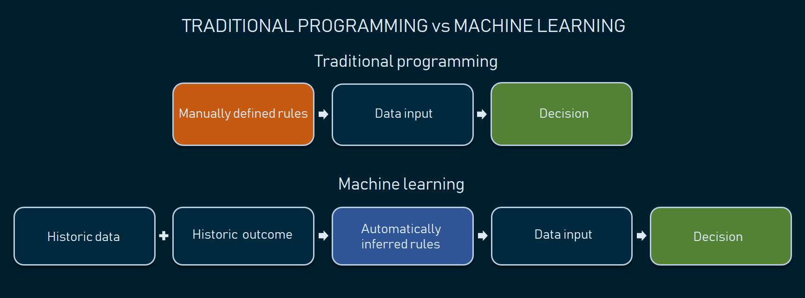
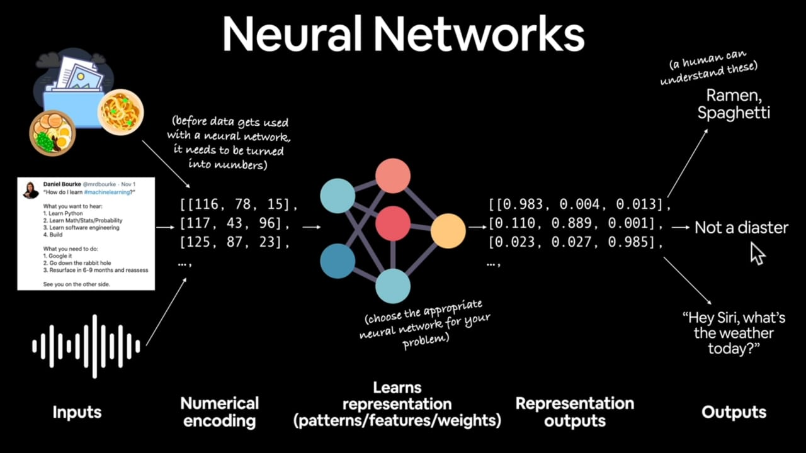
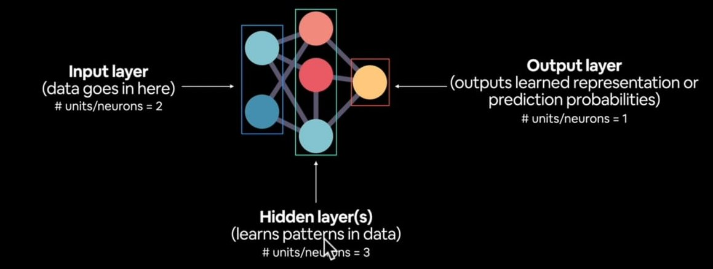
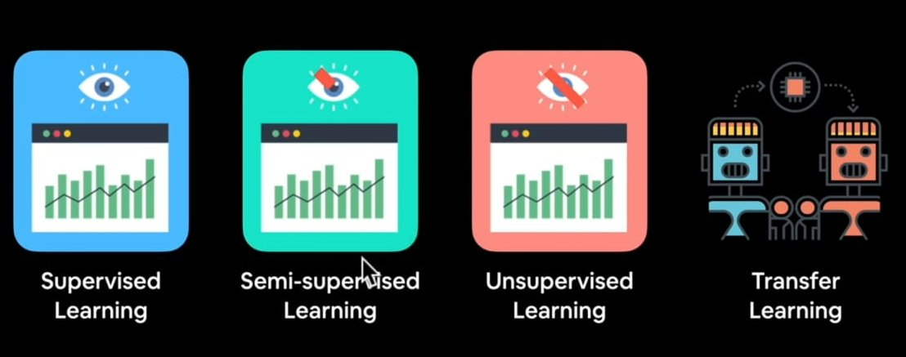
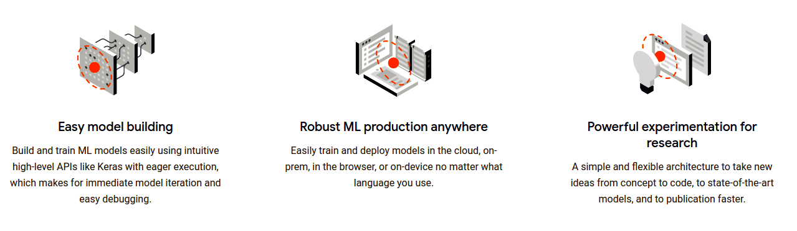

# Deep Learning With Tensorflow

### What is deep learning ?

- A type of machine leartning based on AI in which layers of processing are used to extract progressively hiegher level features from data.

```
"Machine learning is turning things (data) into numbers nad finding patterns in those numbers."
```

### Machine Learning Vs Deep Learning

<br/>
- Machine learning works on Structured Data.
- **Deep learning works on unstructured data**



### Difference between traditional programming and machine learning programming :

- In traditional programming rules and input are provided by programmers and output is generated by machine/program.

- In machine Learning input and output are provided by programmer and machine will find the rules/pattern.



### Why to use Machine Learning / Deep Learning ?

- **Good Reason :** Why Not?
- For a complex problem can you think of all the rules ?
- If youn can build a simple **rule-based** system that does not require ML, then do that.

### What deep learning is good for

- **Problems with Long list of rules** - when the traditional approach fails, machine learning / deep learning may help.

- **continually changing environment** - Deep learning can adapt ('learn') to new scenarios.
- **Discovering insights within large collection of data** - Take photo of food and identify which food is this. Can you imagine trying handcraft rules for what 101 different kind of food look like?

### What deep learning is not goot for

- **When you need explainablity** - The pattern learned by model is typpically un iterpretable.

- **When traditional approach is better approach** - If simple Rule-Based syatem is easy to implement then it is good to go for traditional approach.

- **When Errors are unacceptable** - Since the ouput of deep learning model are not always predictable.

- **When You don't have much data** - Deep learning model requires fairly large amount of data to produce result with greater accuracy.

### Machine Learning Algorithms

**Based on Structured data**

- Random Forest
- Naive Bayes
- Neares Neighbour
- Support Vector Machine
- .... many more

  These ate called shallow algorithms.

### Deep Learning Algorithms

**Based on Unstructured data**

- Neural Networks
- Fully connected neural network
- Convolutional nural network
- Recurrent Neural Network
- .... many more

**_Depending on how we represent our problem many algorithms can be used for both data_**

### What Are Neural Networks ?



### Anatomy of Neural Network



- Pattern refers to "embedding", "weight", "Feature representation", "feature vector" all are refering to saimilar terms.

### Types Of Learning

- Supervised Learning
- Semi Supervised Learning
- Unsupervised Learning
- Transfer Learning



#### Supervised vs unsupervised

The main distinction between the two approaches is the use of labeled datasets. To put it simply, supervised learning uses labeled input and output data, while an unsupervised learning algorithm does not.

#### Transfer learning

Transfer learning (TL) is a research problem in machine learning (ML) that focuses on storing knowledge gained while solving one problem and applying it to a different but related problem. For example, knowledge gained while learning to recognize cars could apply when trying to recognize trucks.

### What is deep Learning Actually used for ?

I think you can use ML for literally anything as long as you can convert it into numbers and program it to find pattern.
Literally it could be anything any input or Output from the universe.

### Deep Learning Use cases

- Recomendation
- sequence2Sequence
  - translation
  - Speech Recognition
- classificaion,regression
  - Computer Graphics
  - Natural Language Proccessing (NLP)
    - spam messages

# TensorFlow

- End to End platform for machine learning.
- write fast deep learning code in python / other accesible language(able to run on GPU and TPU-tensor processing unit)
- Able to access many prebuilt deep learning models (TensorFlow Hub)
- **Whole Stack** : preprocess data, model data, deplay model in your application.

- Originally designed and used in house by google.

### Why Tensor Flow ?


